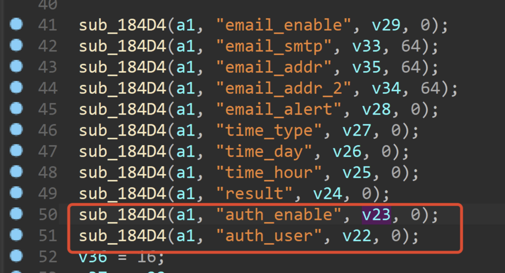

### Netgear R6400 存在命令注入漏洞

#### 写在前面

官网：https://www.netgear.com/

固件下载地址：https://www.netgear.com/support/product/R6400.aspx#download

#### 版本证明

#### 漏洞细节



程序通过获取auth_user和auth_enable数的值，传递给v22和v23


之后通过v23进行对比，如果是1，那么执行if判断下的逻辑，将v22通过acosNvramConfig_set函数设置给smtp_auth_user


在sub_9D8C函数中，通过acosNvramConfig_get函数获取stmp_auth_user的值传递给v55，之后将v55通过strcpy函数拷贝进byte_155E0中


在acosFw_EmailAuthFailNotify函数中，通过sprintf函数，将byte_155e0格式化进byte_157e8中，最后通过system函数执行byte_157e8中的内容，存在命令注入漏洞。

#### 漏洞复现和POC

1.您可以使用fat去模拟固件R6400-V1.0.1.78_1.0.50.chk

2.您可以使用下面POC进行攻击

```
curl -i -X POST http://192.168.0.1/goform/form2Dhcpip.cgi -d tokenid=xxxx -d 'auth_enable=1&auth_user="||ls > /tmp/123'
```


最后，您可以使用精心构造的好的payload获取一个稳定的root shell。